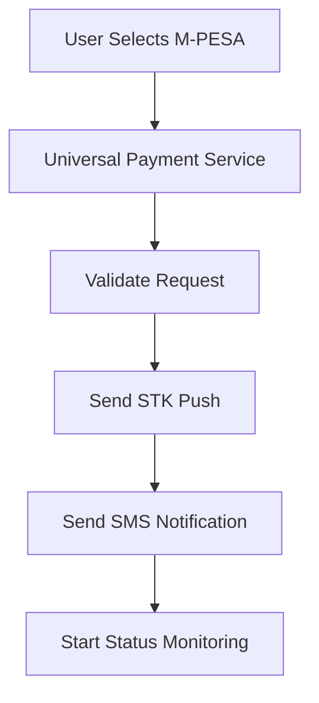
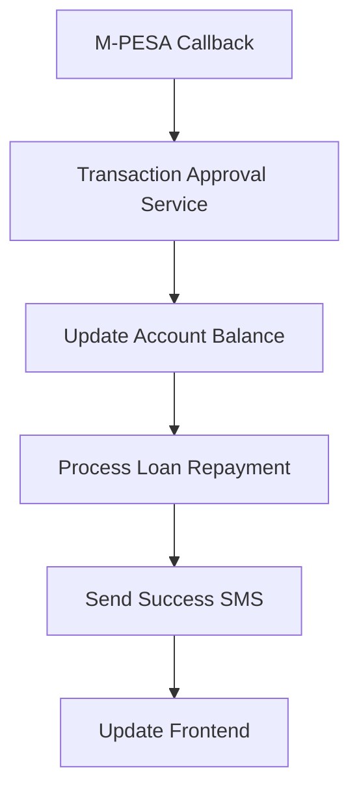

# Enhanced M-PESA & SMS Integration Guide
**HelaSuite Sacco Management System**

## Overview

This guide documents the comprehensive M-PESA STK Push and SMS notification integration implemented across the HelaSuite platform. The system provides configurable payment processing with automatic account updates and SMS notifications.

## 🚀 Key Features

### ✅ M-PESA STK Push Integration
- **Configurable M-PESA Providers**: Support for multiple M-PESA configurations
- **Real-time STK Push**: Automatic payment prompts sent to customer phones
- **Status Monitoring**: Real-time payment status checking and updates
- **Callback Processing**: Automatic handling of M-PESA payment confirmations
- **Error Handling**: Comprehensive error management with user notifications

### ✅ SMS Notification System
- **Multi-Provider Support**: Africa's Talking, TextSMS, Custom GET APIs
- **Payment Notifications**: Automatic SMS for all payment statuses
- **Configurable Messages**: Customizable SMS templates
- **Error Notifications**: SMS alerts for payment failures
- **Reminder System**: Payment due and overdue notifications

### ✅ Universal Payment Service
- **Platform-wide Consistency**: Single service for all payment types
- **Automatic Integration**: M-PESA and SMS automatically triggered
- **Account Updates**: Real-time balance and loan repayment processing
- **Transaction Tracking**: Complete audit trail for all payments

## 🏗️ Architecture

### Backend Components

#### 1. UniversalPaymentService
- **Location**: `com.example.demo.finance.payments.services.UniversalPaymentService`
- **Purpose**: Central payment processing with M-PESA and SMS integration
- **Key Methods**:
  - `processPayment()` - Main payment processing entry point
  - `checkPaymentStatus()` - Status checking for M-PESA payments
  - `sendPaymentReminder()` - Payment reminder notifications
  - `sendOverdueNotification()` - Overdue payment alerts

#### 2. Enhanced MpesaService
- **Location**: `com.example.demo.finance.payments.services.MpesaService`
- **Enhancements**:
  - Integrated SMS notifications for all payment events
  - Improved error handling with user notifications
  - Automatic account updates via TransactionApprovalService

#### 3. SMS Service Integration
- **Location**: `com.example.demo.sms.SmsService`
- **Features**:
  - Payment confirmation messages
  - STK Push initiation notifications
  - Error and failure alerts
  - Customizable message templates

### Frontend Components

#### 1. Enhanced Client Profile Component
- **Location**: `client-profile.component.ts`
- **Features**:
  - Real-time M-PESA payment processing
  - Status checking with visual feedback
  - Dynamic payment method selection
  - Automatic modal updates and notifications

#### 2. Universal Payment Integration
- **Location**: `client.service.ts`
- **Updates**:
  - Unified payment processing endpoint
  - Enhanced status checking
  - Payment reminder services

## 🔧 Configuration

### M-PESA Configuration
The system supports multiple M-PESA configurations stored in `mpesa_config` table:

```sql
-- Example M-PESA Configuration
INSERT INTO mpesa_config (
    config_name, 
    shortcode, 
    consumer_key, 
    consumer_secret, 
    passkey, 
    api_url, 
    callback_url,
    active,
    default_config
) VALUES (
    'Production Config',
    '174379',
    'your_consumer_key',
    'your_consumer_secret',
    'your_passkey',
    'https://api.safaricom.co.ke',
    'https://yourdomain.com/api/mpesa/callback',
    true,
    true
);
```

### SMS Configuration
Configure SMS providers in `sms_config` table:

```sql
-- Example SMS Configuration (Africa's Talking)
INSERT INTO sms_config (
    provider_type,
    api_key,
    username,
    sender_id,
    api_url,
    active,
    default_config
) VALUES (
    'AFRICAS_TALKING',
    'your_api_key',
    'your_username',
    'HELASUITE',
    'https://api.africastalking.com/version1/messaging',
    true,
    true
);
```

## 🔄 Payment Flow

### 1. Payment Initiation


### 2. Status Checking
- Frontend polls payment status every 5 seconds
- Maximum 15 status checks (75 seconds total)
- Real-time UI updates based on status

### 3. Payment Completion


## 📱 Frontend Usage

### Client Profile Payment
```typescript
// Example payment processing
const paymentData = {
  customerId: profile.client.id,
  customerName: `${profile.client.firstName} ${profile.client.lastName}`,
  phoneNumber: profile.client.phoneNumber,
  amount: form.value.amount,
  paymentMethod: 'MPESA', // Triggers STK Push
  transactionType: 'DEPOSIT',
  transactionCategory: 'SAVINGS_DEPOSIT'
};

this.clientService.createDepositRequest(paymentData).subscribe(response => {
  if (response.checkoutRequestId) {
    // Start status monitoring
    this.startMpesaStatusCheck(response.checkoutRequestId);
  }
});
```

### Status Checking
```typescript
private checkMpesaStatus(): void {
  this.clientService.getMpesaDepositStatus(checkoutRequestId).subscribe(status => {
    if (status.resultCode === '0') {
      // Payment successful
      this.handlePaymentSuccess(status);
    } else if (status.resultCode === '1032') {
      // User cancelled
      this.handlePaymentCancellation();
    }
  });
}
```

## 🔌 API Endpoints

### Universal Payment Processing
```http
POST /api/payments/universal/process
Content-Type: application/json

{
  "customerId": 123,
  "customerName": "John Doe",
  "phoneNumber": "+254700123456",
  "amount": 1000.00,
  "paymentMethod": "MPESA",
  "transactionType": "DEPOSIT",
  "description": "Savings deposit"
}
```

### Payment Status Check
```http
GET /api/payments/universal/status/{checkoutRequestId}
```

### Payment Reminders
```http
POST /api/payments/universal/reminder
Content-Type: application/json

{
  "phoneNumber": "+254700123456",
  "customerName": "John Doe",
  "amount": 1000.00,
  "dueDate": "2024-12-31",
  "accountType": "LOAN"
}
```

## 📊 SMS Message Templates

### Payment Confirmation
```
Payment of KES 1,000.00 received. Receipt: ABC123XYZ. 
Remaining balance: KES 500.00. 
Thank you for your payment. HelaSuite.
```

### STK Push Initiated
```
Please check your phone for the M-PESA prompt to complete payment of KES 1,000.00. 
Enter your PIN to confirm. HelaSuite.
```

### Payment Reminder
```
Dear John, this is a reminder that your loan payment of KES 1,000.00 is due on 2024-12-31. 
Please ensure timely payment to avoid penalties. HelaSuite.
```

## 🔧 Deployment & Configuration

### 1. Backend Deployment
```bash
# Build the application
mvn clean package

# Run with production profile
java -jar target/demo-0.0.1-SNAPSHOT.jar --spring.profiles.active=production
```

### 2. Database Setup
- Ensure M-PESA and SMS configuration tables are populated
- Configure callback URLs for M-PESA integration
- Set up proper SSL certificates for production

### 3. Environment Variables
```bash
# M-PESA Configuration
MPESA_CONSUMER_KEY=your_consumer_key
MPESA_CONSUMER_SECRET=your_consumer_secret
MPESA_PASSKEY=your_passkey

# SMS Configuration  
SMS_API_KEY=your_sms_api_key
SMS_USERNAME=your_sms_username
```

## 🧪 Testing

### 1. M-PESA Integration Testing
```bash
# Test STK Push (Sandbox)
curl -X POST http://localhost:8080/api/payments/universal/process \
  -H "Content-Type: application/json" \
  -d '{
    "customerId": 1,
    "customerName": "Test User",
    "phoneNumber": "+254708374149",
    "amount": 100.00,
    "paymentMethod": "MPESA",
    "transactionType": "DEPOSIT"
  }'
```

### 2. SMS Testing
```bash
# Test SMS notification
curl -X POST http://localhost:8080/api/sms/config/send \
  -H "Content-Type: application/json" \
  -d '{
    "phoneNumber": "+254700123456",
    "message": "Test SMS from HelaSuite",
    "messageType": "SMS"
  }'
```

## 🚨 Error Handling

### Common Issues & Solutions

#### 1. M-PESA STK Push Fails
- **Check**: M-PESA configuration (consumer key, secret, passkey)
- **Verify**: Phone number format (+254XXXXXXXXX)
- **Ensure**: Callback URL is accessible
- **Solution**: Review logs for specific error codes

#### 2. SMS Not Sending
- **Check**: SMS provider configuration
- **Verify**: SMS provider account balance
- **Ensure**: Phone numbers are properly formatted
- **Solution**: Test with SMS provider's API directly

#### 3. Payment Status Not Updating
- **Check**: M-PESA callback URL configuration
- **Verify**: Callback endpoint is reachable
- **Ensure**: Database connectivity
- **Solution**: Monitor callback logs

## 📈 Monitoring & Analytics

### Key Metrics to Monitor
- **Payment Success Rate**: Percentage of successful M-PESA payments
- **SMS Delivery Rate**: Percentage of successfully delivered SMS
- **Payment Processing Time**: Average time from initiation to completion
- **Error Rates**: Failed payments and SMS delivery failures

### Logging
- All payment transactions are logged with full audit trails
- SMS notifications include delivery status tracking
- Error logs contain detailed information for troubleshooting

## 🔒 Security Considerations

### 1. M-PESA Security
- Consumer keys and secrets stored securely
- Callback URL validation implemented
- Transaction verification using M-PESA receipts

### 2. SMS Security
- API keys stored in environment variables
- Phone number validation and formatting
- Message content sanitization

### 3. General Security
- HTTPS enforced for all endpoints
- Request validation and sanitization
- Proper error handling without information disclosure

---

## 📞 Support

For technical support or questions about the M-PESA and SMS integration:

1. Check the application logs for detailed error information
2. Verify configurations in the admin panel
3. Test with sandbox/test environments first
4. Contact the development team with specific error codes

---

**Last Updated**: November 2024  
**Version**: 2.0  
**Status**: Production Ready ✅
